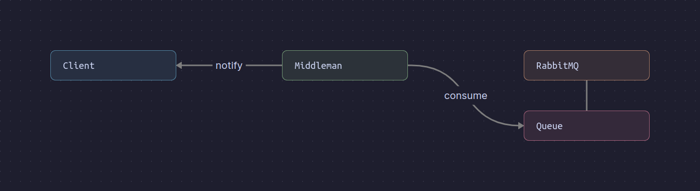

# RabbitMQ Middleman

A middleman to consume messages from a RabbitMQ queue and send them through a websocket connection to a client.

## Requirements

This project was developed using Go v1.21.4.

You will also need a RabbitMQ instance. It is recommended to use a docker image.

## Usage

Clone the current repository and build an executable of the project:

```sh
go mod tidy
go build -o middleman main.go
```

The basic usage is the following:

```sh
middleman [rabbitmq_url] [rabbitmq_queue_name] [listening_port]
```

## How does it work ?

Here is diagram of how the middleman is working:



The middleman consumes messages from a RabbitMQ queue. A client can connect to the middleman via a websocket connection. When connected, the client will receive the consumed messages from the middleman.

The server is running on `localhost:[listening_port]` and the websocket endpoint is `localhost:[listening_port]/ws`.

If no client has established a websocket connection with the server, the messages are stored in memory. When a client connects, the stored messages are sent to the client.
